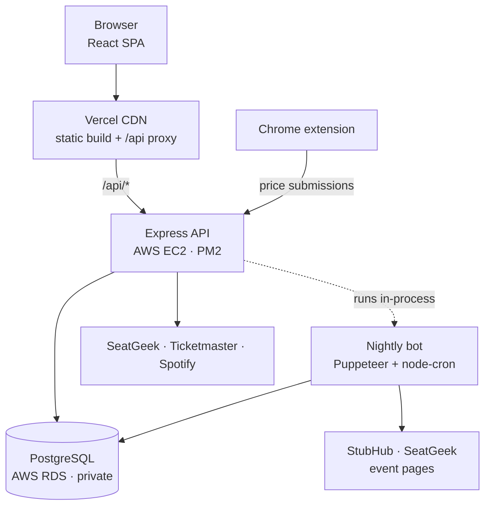

# Front Row

Concert ticket price tracking and drop prediction. Search a show, see what the
cheapest ticket costs, and get an answer to the only question that matters:
**buy now, or wait?**

**Live:** https://frontrow-tickets.vercel.app

Concerts only — no sports, no theater. Built because every existing tool either
buries music under stadium schedules or shows you a price with no idea whether
it's a good one.

---

## The problem this project is actually solving

SeatGeek and Ticketmaster both have clean, well-documented event APIs. Neither
will give you **resale prices** without partner-level access — `stats.lowest_price`
comes back empty, `priceRanges` comes back absent. You can find out that Zach
Bryan plays Denver in August. You cannot find out what a ticket costs today, and
you certainly cannot find out what it cost last Tuesday.

That killed the obvious version of this product and forced the interesting one:
**if the price history doesn't exist anywhere, build it.**

Two independent collectors write to the same table:

1. **A nightly Puppeteer bot** on EC2 visits each tracked event's page on
   StubHub and SeatGeek, reads the get-in price, and records one snapshot per
   event per marketplace per night.
2. **A Chrome extension** lets a real person submit a price from a real browser
   while they're already shopping — which reaches pages no headless scraper
   reliably can.

Every night the dataset gets more valuable and harder to copy. That dataset is
the product; the UI is how you read it.

---

## Architecture



The frontend never talks to the API host directly. Vercel rewrites `/api/*`
server-side to EC2, which sidesteps the mixed-content block on an HTTPS page
calling a plain HTTP origin and means there is no CORS configuration to keep in
sync. The browser only ever sees one origin.

The database is not on the internet. Its security group allows port 5432 only
from the EC2 instance's security group, so the API is the sole path to it.

---

## Stack

| Layer | Choice | Why |
| --- | --- | --- |
| Frontend | React 19, Vite, TypeScript, Tailwind v4, React Router 7 | Static build, served from a CDN |
| Backend | Node, Express, TypeScript | Long-running process — it also hosts the cron |
| Database | PostgreSQL on AWS RDS, Prisma | Time-series price data with real constraints |
| Scraper | Puppeteer, node-cron | Prices are rendered by JavaScript; `fetch` returns an empty shell |
| Hosting | Vercel + AWS EC2 | Static hosting belongs on a CDN; cron jobs belong on a server |
| Data | SeatGeek, Ticketmaster, Spotify | Events, genres and on-sale dates, artist photos |

---

## What works today

- **Search** concerts by artist, scoped to a city you pick in the header
- **Event pages** with venue, date, on-sale and presale dates, and buy links to
  four marketplaces
- **Artist pages** with photo, genres, and upcoming shows
- **Genre browse** across seven genres, ranked by relevance over the next three months
- **Deployed end to end** — every push to `main` ships the frontend automatically

**In progress:** the nightly bot is written and deployed but its selectors are
not yet verified against live pages, so price fields currently render
"Price tracking soon". The Monte Carlo model is designed and specified but not
yet built — it needs snapshot history to be worth running.

---

## The prediction model

Once a tracked event has price history, the forecast is a Monte Carlo
simulation rather than a rule engine:

1. Read every snapshot for the event in time order
2. Compute daily deltas, then μ and σ of those deltas
3. Run 10,000 paths forward 14 days, each step adding a `Normal(μ, σ)` sample
4. At days 7 and 14, take `P(price < today's price)` and the p10 / p50 / p90 percentiles

Rules can't express what this does. Two events priced identically today but with
different volatility histories deserve different forecasts — a placid one gets a
narrow cone and a confident recommendation, a jumpy one gets a wide cone and a
hedge. That falls out of σ for free. It's the same reasoning behind options
pricing.

Confidence is reported honestly and scales with sample size: fewer than 7
snapshots is LOW, 22 or more is HIGH.

---

## Engineering decisions worth explaining

**Idempotency is enforced by Postgres, not by application code.**
`PriceSnapshot` has a `DATE` column separate from its timestamp, with
`@@unique(eventId, marketplace, observedOn)`. The bot must be safe to run twice,
and a timestamp can never express that — two runs are never the same instant. A
check-then-insert in application code would race. Keying the constraint on the
*day* makes "safe to rerun" a database guarantee.

**Event IDs carry their provider.** `sg-17871645` and `tm-G5dFZ975dZstp` come
from unrelated ID spaces. Prefixing them lets one card component and one detail
page serve results from either provider without the frontend ever knowing which
API answered.

**Genre browse runs on Ticketmaster because SeatGeek has no music genres.**
Dumping SeatGeek's `/taxonomies` endpoint proved it: the entire Concerts branch
is two nodes, "Concert" and "Music Festivals". Not a wrong parameter — the data
doesn't exist. Ticketmaster classifies music as Segment > Genre > Sub-Genre, and
genre is filtered by exact `genreId` rather than by name, since name matching
also pulls in sub-genres.

**Scraper selectors are arrays, not strings.** Ticket sites reship markup
constantly. A list of candidates lets an old selector keep working while a new
one is added, and every failure saves a screenshot and the page HTML so a broken
selector is diagnosed from evidence instead of guesswork.

**The bot never throws.** Every failure logs and continues. A missed night
cannot be backfilled — nobody can tell you what a ticket cost last Tuesday — so
one dead page must never abandon the rest of the run.

---

## Local setup

Two separate npm projects; there is no root `package.json`.

```bash
git clone https://github.com/danielj2290/FrontRow.git
cd FrontRow
cp .env.example .env     # fill in your own API keys
```

`.env` lives at the **repo root**, not in `/backend` — one file shared by
everything, one place to rotate keys.

```bash
cd backend && npm ci && npm run dev      # API on :3000
cd frontend && npm ci && npm run dev     # Vite on :5173, proxies /api
```

Useful scripts:

```bash
npm run test:apis                    # verify all three API integrations
npm run track -- sg-17871645         # add an event to the nightly scrape list
npm run bot -- --probe --site seatgeek   # scrape one page, save screenshot + HTML
npm run prisma:migrate               # run migrations (needs DATABASE_URL)
```

---

## API

| Endpoint | Description |
| --- | --- |
| `GET /api/events?artist=&city=&genre=&limit=` | Search. At least one filter required |
| `GET /api/events/:id` | One event — accepts `sg-` or `tm-` prefixed IDs |
| `GET /api/artists/:name` | Artist profile with upcoming shows |
| `GET /api/health` | Liveness check |

---

## Roadmap

- [x] Event search, detail, artist and genre pages
- [x] Deployed frontend and API
- [x] Database schema and migrations
- [ ] Nightly bot capturing verified prices
- [ ] Price history charts and 3-day change
- [ ] Chrome extension published
- [ ] Accounts, favorites and price-drop alerts
- [ ] Monte Carlo forecasts on every event page

---

## License

MIT
